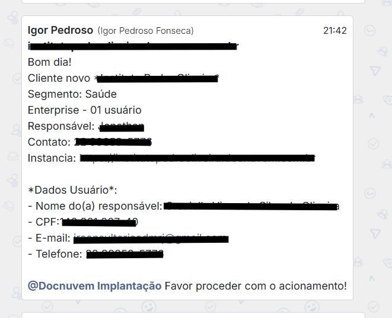
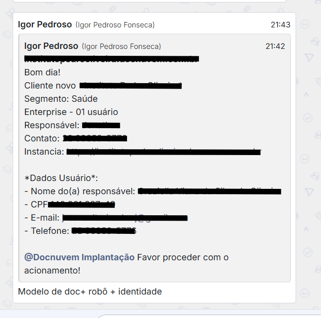

# 01 - Início do processo

## Quando se aplica

No início de toda implantação, antes de qualquer configuração no sistema.

## O que acontece

O processo de implantação começa quando os dados da nova instância e do novo usuário são enviados no grupo **Implantações Docnuvem 💻🚀**.

Quando o plano contratado for **Enterprise**, o Igor também envia, na mesma mensagem, quais módulos foram contratados.

## Passo a passo

1. Acompanhar o grupo de Implantações e aguardar o envio dos dados da instância e do usuário.
2. Se o plano for Enterprise, anotar os módulos contratados informados pelo Igor — serão usados em [05 - Funcionalidades Enterprise](05-funcionalidades-enterprise.md).
3. Seguir para [02 - Configurações da empresa](02-configuracoes-da-empresa.md).

## Se travar

Se o acesso ao link da instância apresentar algum erro, reportar imediatamente no grupo de Implantações.

## Relacionados

- [Processo de Implantação](index.md)
- Próxima etapa: [02 - Configurações da empresa](02-configuracoes-da-empresa.md)
