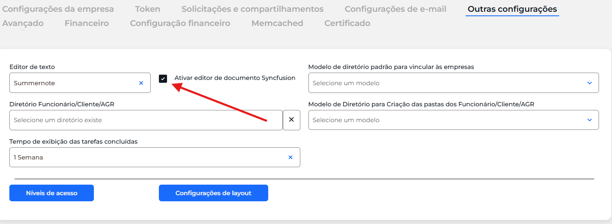

# 03 - Outras configurações

## Quando se aplica

Logo após configurar os dados da empresa (ver [02 - Configurações da empresa](02-configuracoes-da-empresa.md)).

## Passo a passo

Acesse **Configurações do sistema → Outras configurações** e ative o **SyncFusion**.

!!! tip "Dica"
    Ative o SyncFusion mesmo quando o cliente ainda não tiver modelos de documentos cadastrados — isso facilita um futuro upsell.

## Se travar

Reporte no grupo de Implantações.

## Relacionados

- [Processo de Implantação](index.md)
- Anterior: [02 - Configurações da empresa](02-configuracoes-da-empresa.md) · Próxima etapa: [04 - Configurações avançado](04-configuracoes-avancado.md)
