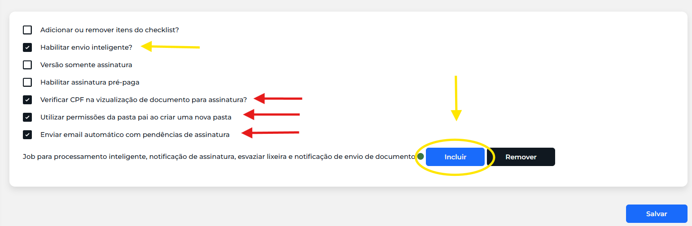

# 04 - Configurações avançado

## Quando se aplica

Logo após ativar o SyncFusion (ver [03 - Outras configurações](03-outras-configuracoes.md)).

## Passo a passo

Acesse **Configurações do sistema → Avançado** e marque:

- **Verificar CPF na visualização de documento para assinatura?**
- **Utilizar permissões da pasta pai ao criar uma nova pasta**
- **Enviar e-mail automático com pendências de assinatura**
- Se o **Envio Inteligente** for um dos módulos contratados: marque **Habilitar envio inteligente?** e clique em **Incluir** para adicionar o job.

## Se travar

Reporte no grupo de Implantações.

## Relacionados

- [Processo de Implantação](index.md)
- Anterior: [03 - Outras configurações](03-outras-configuracoes.md) · Próxima etapa: [05 - Funcionalidades Enterprise](05-funcionalidades-enterprise.md)
