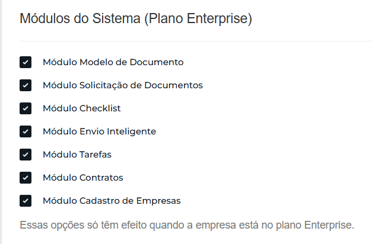

# 05 - Funcionalidades Enterprise

## Quando se aplica

Apenas para clientes do **plano Enterprise**, logo após a etapa [04 - Configurações avançado](04-configuracoes-avancado.md).

## Passo a passo

1. Acesse **Configurações do sistema → Funcionalidades Enterprise**.
2. Ative os módulos referentes ao contrato do cliente — essa informação foi enviada no grupo de Implantações (ver [01 - Início do processo](01-inicio-do-processo.md)).

!!! info "Importante"
    Sempre que o módulo **"Modelos Modelo de Documentos"** for contratado, o **Módulo Contratos** já está implícito — não é preciso confirmar isso separadamente com o cliente.

## Se travar

Qualquer dúvida sobre quais módulos ativar, perguntar ao Igor.

## Relacionados

- [Processo de Implantação](index.md)
- Anterior: [04 - Configurações avançado](04-configuracoes-avancado.md) · Próxima etapa: [06 - Cadastro do primeiro usuário](06-cadastro-do-primeiro-usuario.md)
- Veja também no Manual do Sistema: [Tipos Cadastrados](../../manual/09-tipos-cadastrados.md), [Meus Modelos](../../manual/08-meus-modelos.md)
