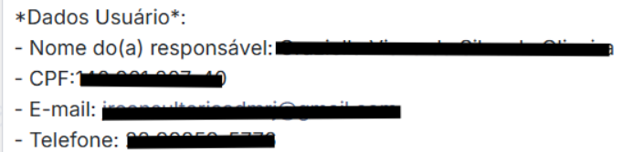

# 06 - Cadastro do primeiro usuário

## Quando se aplica

Última etapa da configuração inicial da instância, depois de concluídas as etapas anteriores (empresa, outras configurações, avançado e, se Enterprise, funcionalidades Enterprise).

## Passo a passo

Com os dados enviados no grupo de Implantações (ver [01 - Início do processo](01-inicio-do-processo.md)) e o link da instância em mãos, cadastre o primeiro usuário (administrador).

## Se travar

Reporte no grupo de Implantações.

## Relacionados

- [Processo de Implantação](index.md)
- Anterior: [05 - Funcionalidades Enterprise](05-funcionalidades-enterprise.md) · Próxima etapa: [07 - Cadastro do contato no Digisac](07-cadastro-do-contato-no-digisac.md)
- Veja também no Manual do Sistema: [Meus Cadastros (Cadastro de Usuários)](../../manual/07-meus-cadastros.md#usuarios)
