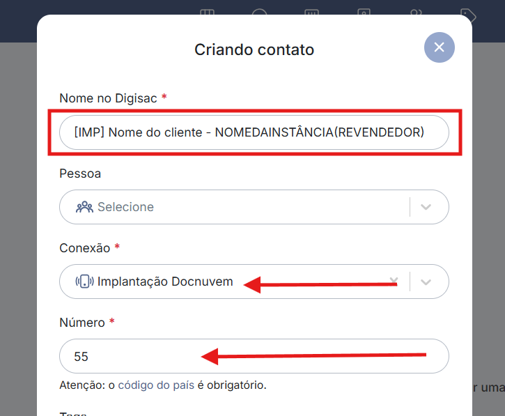

# 07 - Cadastro do contato no Digisac

## Quando se aplica

Antes do primeiro contato com o cliente, depois de concluída a configuração inicial da instância (ver [06 - Cadastro do primeiro usuário](06-cadastro-do-primeiro-usuario.md)).

## Padrão de nome do contato

O nome do contato no número da implantação **deve sempre** seguir esta estrutura:

```
[IMP] (nome do cliente) - NOMEDAINSTÂNCIA(REVENDEDOR)
```

- **[IMP]** — prefixo que indica que a conexão usada é a da implantação. Todas as mensagens enviadas a esse contato usam o WhatsApp da implantação. Manter essa conexão só para contatos de implantação e SLA; assuntos de suporte devem usar outra conexão.
- **(nome do cliente)** — nome da pessoa responsável por conduzir a implantação do lado do cliente.
- **NOMEDAINSTÂNCIA(REVENDEDOR)** — nome da instância matriz do revendedor (ex.: DIGITALLIZA, CERTISEG).



## Se travar

Reporte no grupo de Implantações.

## Relacionados

- [Processo de Implantação](index.md)
- Anterior: [06 - Cadastro do primeiro usuário](06-cadastro-do-primeiro-usuario.md) · Próxima etapa: [08 - Script de primeiro contato](08-script-de-primeiro-contato.md)
