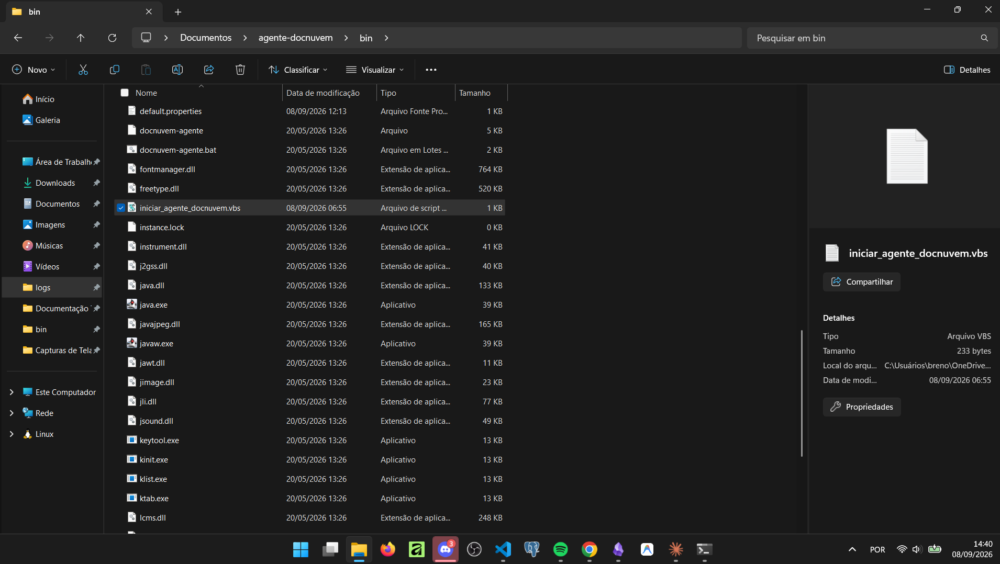
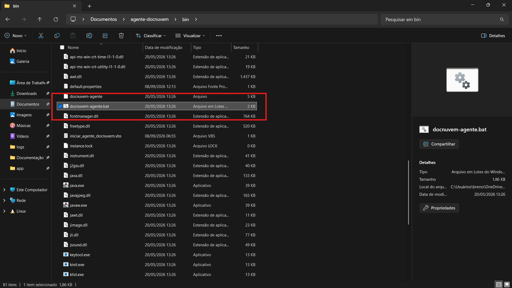
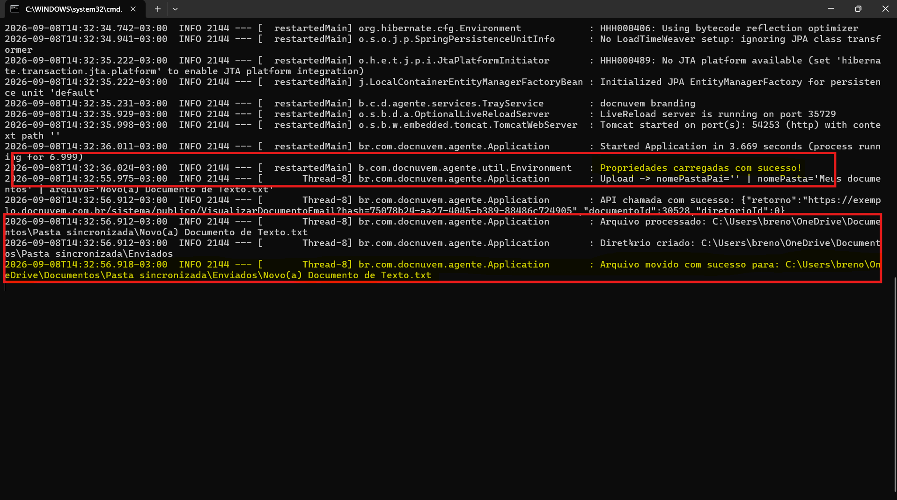
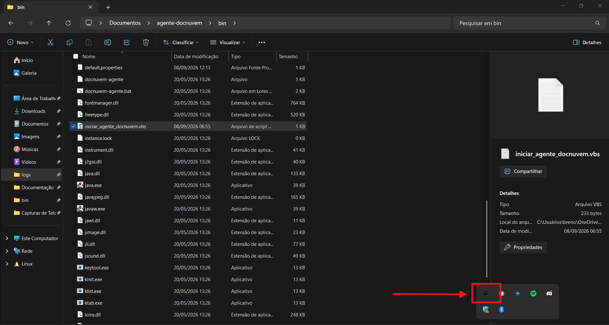
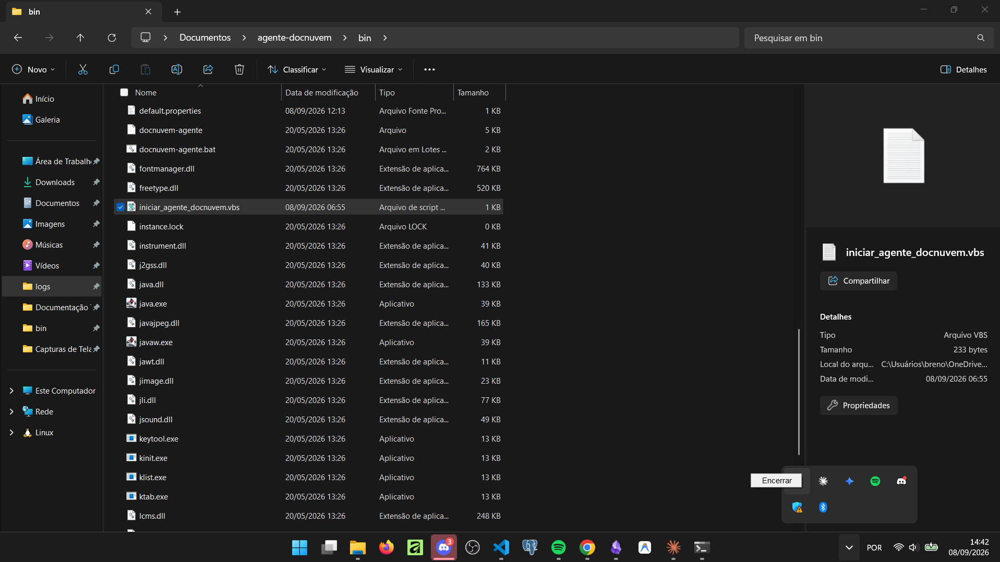

# 05 - Rodar como programa convencional

## Quando se aplica

Depois de configurado o `default.properties` (ver [04 - Configurar o default.properties](04-configurar-o-default-properties.md)), quando o Agente vai rodar como **programa convencional** — ou seja, só enquanto o usuário Windows responsável estiver logado (ver [01 - O que é o Agente Docnuvem](01-o-que-e-o-agente-docnuvem.md)). Para rodar como serviço do Windows, ver [06 - Instalar como serviço do Windows](06-instalar-como-servico-do-windows.md) em vez desta.

A pasta `agente-docnuvem\bin` contém os arquivos usados nesta etapa:

## Com log na tela (útil para testes)

Executar o arquivo `agente-docnuvem\bin\docnuvem-agente.bat`.

Se as configurações foram feitas corretamente, o prompt abre e mostra a mensagem "Propriedades carregadas com sucesso!". Ao colocar um arquivo na pasta monitorada, o log deve mostrar que o envio foi feito com sucesso.

!!! warning "Importante"
    Ao fechar o prompt, o programa deixa de funcionar. Ele precisa permanecer aberto — pode ser minimizado, mas não fechado.

## Em segundo plano (uso do dia a dia)

Para abrir o programa sem que o log apareça na tela, executar o script `agente-docnuvem\bin\iniciar_agente_docnuvem.vbs`. A única evidência de que o programa está em execução é o ícone na bandeja do Windows.

Para finalizar o programa, clicar com o botão direito no ícone da bandeja e escolher "Encerrar".

## Se travar

<!-- TODO: confirmar com Breno qual é o canal/responsável de escalonamento para problemas ao rodar o Agente como programa convencional. -->

## Relacionados

- [Agente Docnuvem (robô)](index.md)
- Anterior: [04 - Configurar o default.properties](04-configurar-o-default-properties.md)
