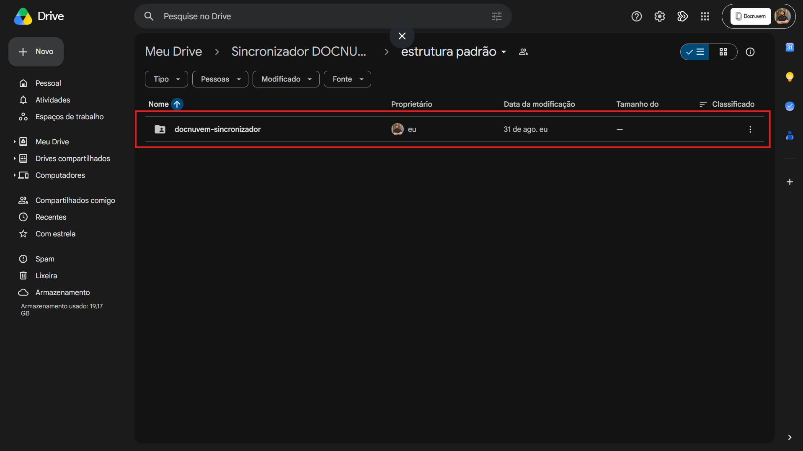
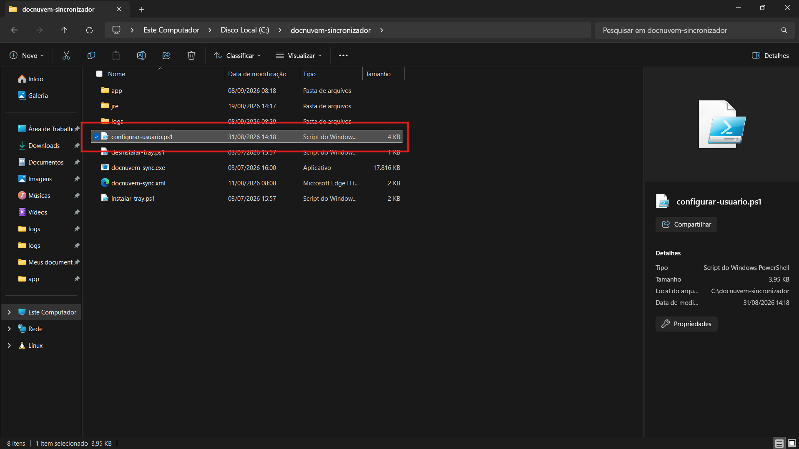
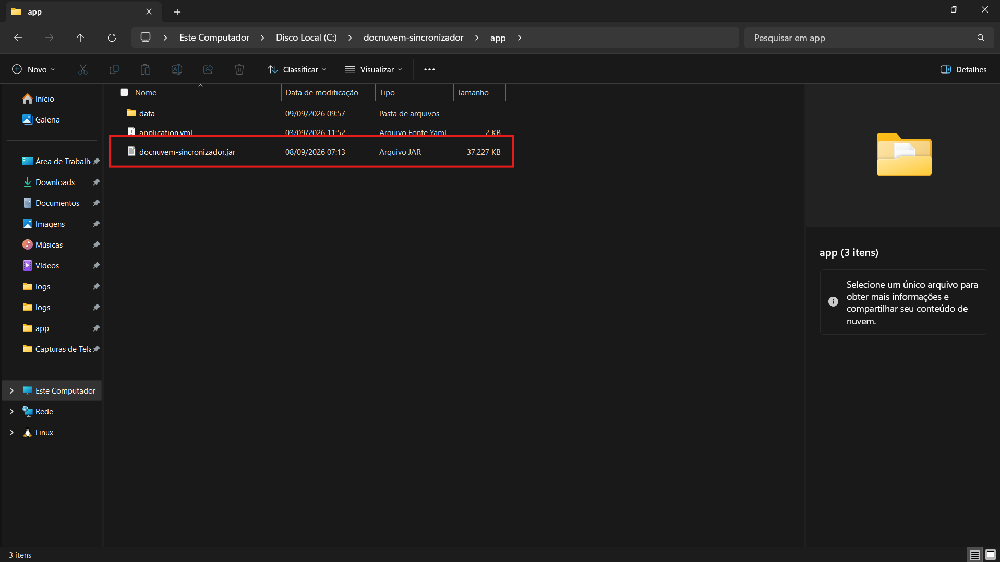

# 04 - Baixar os arquivos de instalação

## Quando se aplica

Depois de ativado o módulo na empresa (ver [03 - Antes de instalar (ativar o módulo na empresa)](03-antes-de-instalar-ativar-o-modulo-na-empresa.md)) — primeiro passo prático de uma instalação nova (máquina que nunca teve o Sincronizador instalado).

## Passo a passo

1. Dentro do repositório (ver [02 - Como se localizar no repositório](02-como-se-localizar-no-repositorio.md)), abrir a pasta **"estrutura padrão"** e baixar a pasta `docnuvem-sincronizador` que fica lá dentro. Colocar em um local fixo da máquina, por exemplo `C:\docnuvem-sincronizador\`.

    

2. Dentro da pasta **"versão atual"**, baixar o arquivo `configurar-usuario.ps1` e colocar na raiz da pasta `docnuvem-sincronizador` (mesmo nível de `docnuvem-sync.exe`, `instalar-tray.ps1` etc.), substituindo o que já estiver lá.

    

3. Ainda dentro de **"versão atual"**, baixar o arquivo `docnuvem-sincronizador.jar` (o programa do Sincronizador em si) e colocar em `docnuvem-sincronizador\app\`.

    

## Na prática

"Estrutura padrão" já traz pronta a base da instalação: o executável `docnuvem-sync.exe`, o Java embutido (pasta `jre\`) e os scripts do ícone de bandeja — não precisa mexer nisso. Os dois arquivos que mudam a cada versão — o `.jar` do sincronizador e o `configurar-usuario.ps1` — sempre vêm de dentro de "versão atual" e são colocados por cima dessa base, sobrescrevendo o que já estiver lá.

!!! warning "Atenção"
    Isso vale para instalação **nova**. Para atualizar uma máquina que já tem o Sincronizador rodando, ver o passo "Atualizar o pacote" em [09 - Vincular cada máquina a um usuário](09-vincular-cada-maquina-a-um-usuario.md).

O pacote já vem com o Java embutido — não é preciso instalar Java na máquina do cliente separadamente.

**Vídeo**

  <iframe src="https://www.youtube.com/embed/Xc_ehR1XMdI" title="Instalação do Sincronizador Docnuvem" allow="accelerometer; autoplay; clipboard-write; encrypted-media; gyroscope; picture-in-picture; web-share" referrerpolicy="strict-origin-when-cross-origin" allowfullscreen></iframe>

## Se travar

<!-- TODO: confirmar com Breno qual é o canal/responsável de escalonamento para problemas ao baixar ou montar os arquivos de instalação do Sincronizador. -->

## Relacionados

- [Sincronizador Docnuvem](index.md)
- Anterior: [03 - Antes de instalar (ativar o módulo na empresa)](03-antes-de-instalar-ativar-o-modulo-na-empresa.md) · Próxima etapa: [05 - Configurar o application.yml](05-configurar-o-application-yml.md)
