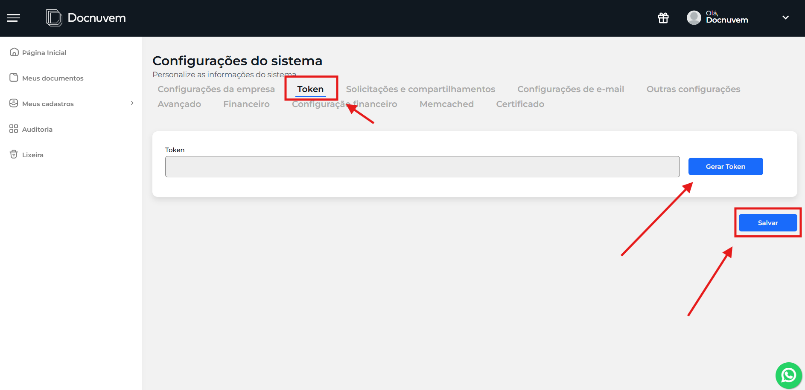

# 05 - Configurar o application.yml

## Quando se aplica

Depois de descompactado o pacote na máquina do cliente (ver [04 - Baixar e descompactar o pacote](04-baixar-e-descompactar-o-pacote.md)) — o arquivo vem com dados de desenvolvimento, é obrigatório trocar pelos dados da empresa antes de instalar o serviço.

## Onde configurar

Abrir o arquivo `app\application.yml` com o Bloco de Notas ou outro editor de texto.

## Na prática — o que precisa ser trocado

Na maioria das instalações, só três campos mudam de empresa para empresa: `instancia`, `token` e `pasta-local-raiz`. Os demais já vêm certos no template e normalmente não precisam ser tocados.

## Estrutura padrão atual

```yaml
# API local de status (consumida pelo tray icon). Loopback apenas — sem exposição na rede.
server:
  address: 127.0.0.1
  port: 8765

spring:
  datasource:
    url: jdbc:sqlite:./data/sync-client.db
    driver-class-name: org.sqlite.JDBC

docnuvem:
  api-base-url: "http://docnuvem-1325424578.sa-east-1.elb.amazonaws.com:8083/api"
  instancia: "exemplo"
  token: "TOKEN_DA_EMPRESA"
  diretorio-raiz-id: 0
  pasta-local-raiz: "C:\\docnuvem-sinc"
  polling-segundos: 30
  download-timeout-segundos: 120
  upload-timeout-segundos: 300
  watcher-habilitado: true
  watcher-debounce-ms: 1500
  upload-polling-segundos: 5
  exclusao-habilitada: true
  exclusao-limite-lote: 50
  rename-correlation-window-ms: 3000
  retry-max-tentativas: 10

logging:
  level:
    root: INFO
```

## Campos

| Campo | Descrição |
|---|---|
| `api-base-url` | Sempre o mesmo endereço — não trocar por empresa. |
| `instancia` | Domínio/subdomínio da instância — igual ao campo `cliente=` do `default.properties` do Agente Docnuvem. |
| `diretorio-raiz-id` | ID da pasta a ser sincronizada no banco de dados. `0` sincroniza "Meus documentos" por completo; para sincronizar outra pasta específica, consultar o Victor. |
| `pasta-local-raiz` | Caminho da pasta no computador que vai ficar sincronizada. |

**`token`** — o token da instância, emitido na plataforma.

!!! warning "Importante"
    **NÃO revogar um token que esteja em uso**, a não ser para retirar o acesso do cliente. Todas as instalações feitas com um token revogado param de funcionar imediatamente. Não esquecer de salvar o token depois de gerado.



Os demais campos (`polling-segundos`, `download-timeout-segundos`, `upload-timeout-segundos`, `watcher-habilitado`, `watcher-debounce-ms`, `upload-polling-segundos`, `exclusao-habilitada`, `exclusao-limite-lote`, `rename-correlation-window-ms`, `retry-max-tentativas`) e o bloco `logging` já vêm com os valores padrão do template acima — normalmente não precisam ser alterados.

Não alterar o bloco `server:` — é a porta interna usada pelo ícone de bandeja, restrita ao próprio computador (loopback, sem exposição na rede). O bloco `spring.datasource` também não deve ser alterado — é o banco local (SQLite) que guarda o estado da sincronização.

!!! warning "Atenção"
    Cada empresa/instalação precisa do seu próprio `token` e `instancia`. Nunca reaproveitar o arquivo de outra empresa.

## Se travar

<!-- TODO: confirmar com Breno qual é o canal/responsável de escalonamento para problemas de configuração do application.yml. -->

## Relacionados

- [Sincronizador Docnuvem](index.md)
- Anterior: [04 - Baixar e descompactar o pacote](04-baixar-e-descompactar-o-pacote.md) · Próxima etapa: [06 - Instalar e iniciar o serviço](06-instalar-e-iniciar-o-servico.md)
- Veja também: [04 - Configurar o default.properties](../agente-docnuvem/04-configurar-o-default-properties.md) (nota do Agente Docnuvem) — mesmo processo de emissão de token
