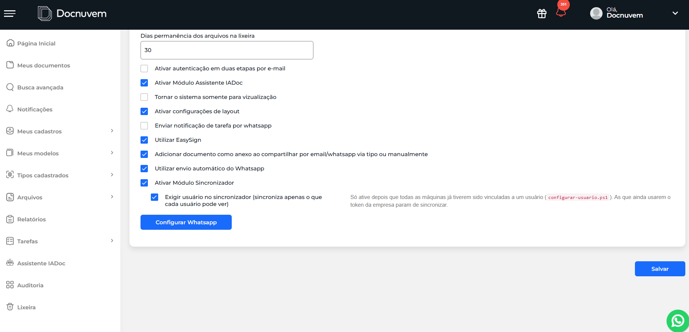

# 10 - Ativar a exigência de usuário na empresa

## Quando se aplica

**Só depois** que todas as máquinas da empresa que devem respeitar as permissões já estiverem vinculadas a um usuário (ver [09 - Vincular cada máquina a um usuário](09-vincular-cada-maquina-a-um-usuario.md)). Ativar antes disso derruba a sincronização das máquinas ainda não vinculadas.

## O que fazer

Nas configurações da empresa, dentro do módulo Sincronizador, marcar **"Exigir usuário no sincronizador (sincroniza apenas o que cada usuário pode ver)"**.

!!! warning "Importante"
    **Máquina não vinculada para de sincronizar assim que essa opção é marcada.** O próprio Docnuvem avisa, ao lado do checkbox: *"Só ative depois que todas as máquinas já tiverem sido vinculadas a um usuário (`configurar-usuario.ps1`). As que ainda usarem o token da empresa param de sincronizar."* Isso é intencional: com a opção marcada, qualquer máquina que tentar sincronizar sem estar vinculada a um usuário é recusada de propósito (ícone roxo, log indicando que a máquina exige login de usuário) — não é um bug, é a opção fazendo o que promete.

A partir daqui, as regras de [11 - Como funciona o controle de permissões ativo](11-como-funciona-o-controle-de-permissoes-ativo.md) passam a valer para as máquinas vinculadas dessa empresa.

## Se travar

Máquina recusada mesmo sem nunca ter sido vinculada — ver [12 - Migrando máquinas aos poucos](12-migrando-maquinas-aos-poucos.md) antes de tratar como bug.

<!-- TODO: confirmar com Breno qual é o canal/responsável de escalonamento para problemas não cobertos ali. -->

## Relacionados

- [Sincronizador Docnuvem](index.md)
- Anterior: [09 - Vincular cada máquina a um usuário](09-vincular-cada-maquina-a-um-usuario.md) · Depois de ativado: [11 - Como funciona o controle de permissões ativo](11-como-funciona-o-controle-de-permissoes-ativo.md)
