# Módulo de Tarefas

O **Módulo de Tarefas** organiza atividades em projetos (quadros Kanban), com visões em lista, quadro e calendário, além de agendamentos recorrentes e fluxo de aprovação.

## Projetos

No Módulo de Tarefas, os projetos representam os quadros Kanban do sistema. Sempre que for necessário criar um novo quadro e definir as etapas do fluxo de trabalho, é preciso cadastrar um projeto.

A tela de Projetos permite visualizar todos os projetos cadastrados, além de editar ou excluir registros existentes, e conta com um botão para cadastrar novos projetos.

Durante a configuração do projeto, também é possível definir se uma etapa exigirá aprovação para que as tarefas avancem no quadro. Quando essa opção é ativada, devem ser indicados os usuários responsáveis por aprovar a movimentação das tarefas naquela etapa.

### Como criar um projeto

1. Na tela de Projetos, clique em **Cadastrar novo projeto**.

    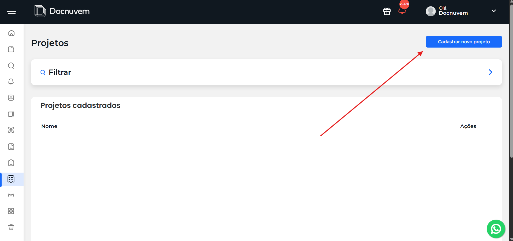

2. Informe o nome do projeto. Opcionalmente, defina por quanto tempo uma tarefa concluída ficará visível no quadro antes de ser ocultada.

    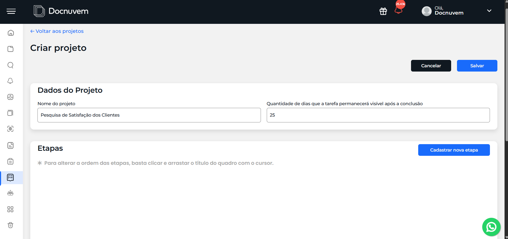

3. Para adicionar as etapas do quadro, clique em **Cadastrar nova etapa** e informe o nome da etapa. As etapas cadastradas podem ser arrastadas para organizar a ordem em que aparecerão no quadro Kanban.

    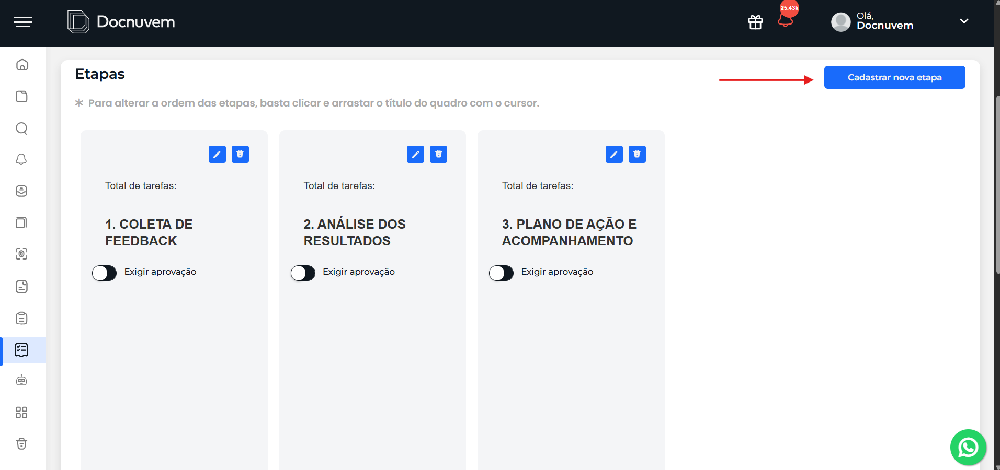

4. Caso uma etapa precise passar por fluxo de aprovação, ative a opção **Exigir aprovação** nessa etapa e adicione os usuários responsáveis pela aprovação.

    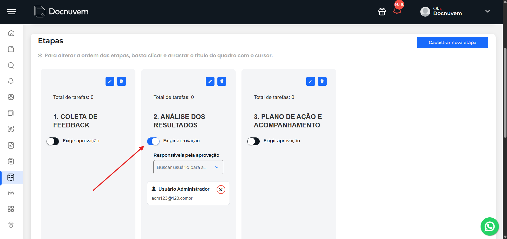

5. Revise as informações e clique em **Salvar**.

    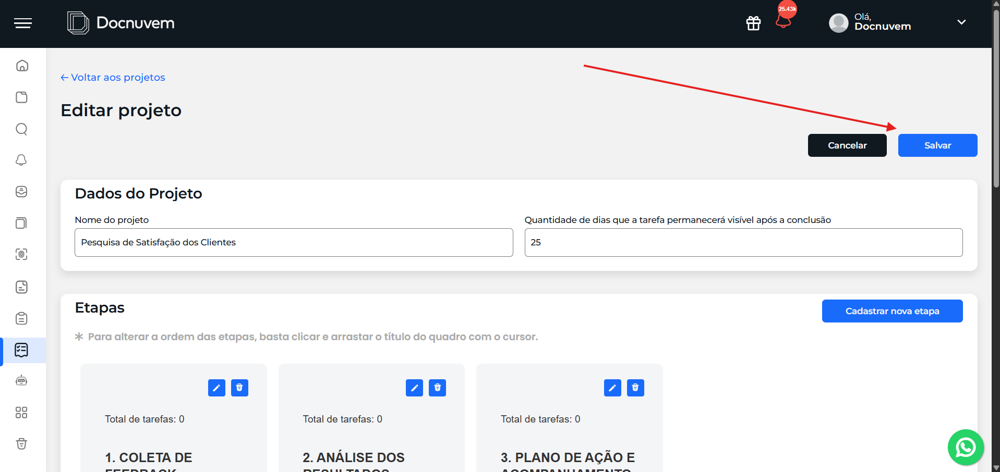

### Como editar um projeto

1. Na listagem de projetos, clique na ação de editar do projeto desejado.

    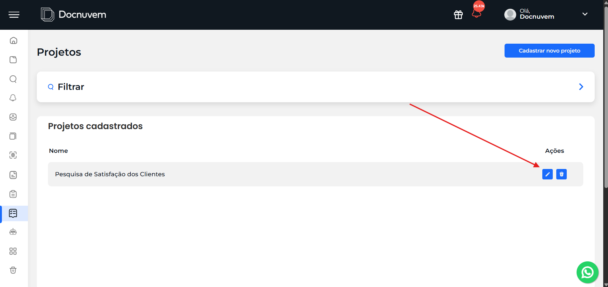

2. Ajuste as informações necessárias. Também é possível adicionar, editar, excluir ou reordenar (arrastando) as etapas do projeto.

    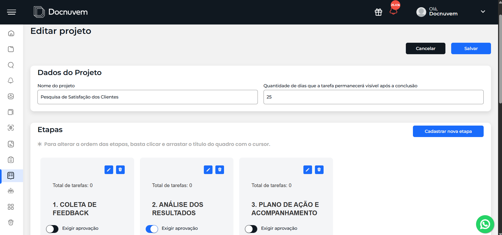

3. Clique em **Salvar** para aplicar as alterações.

    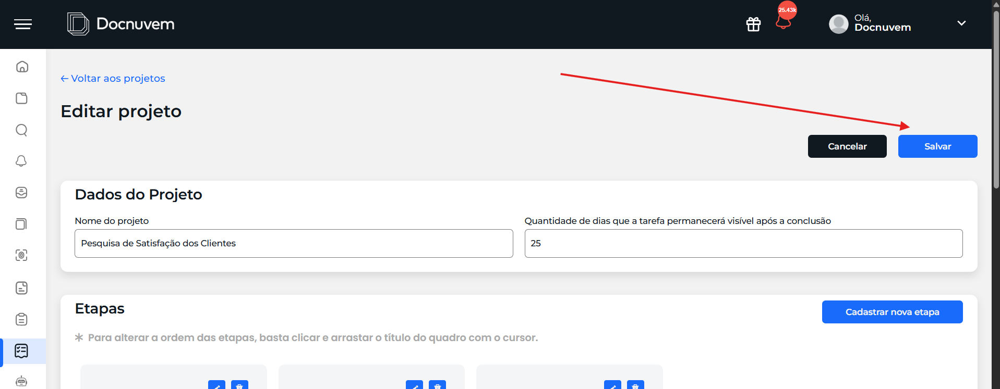

### Como excluir um projeto

Na listagem de projetos, clique na ação de excluir do projeto desejado.

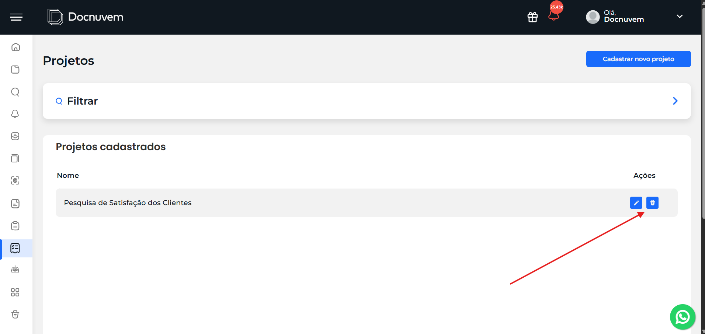

## Tarefas

A tela de Tarefas permite visualizar e acompanhar as tarefas associadas ao usuário, seja como relator ou como responsável pela execução. Ajuda a identificar rapidamente em qual projeto e etapa cada tarefa está, além de prazos, protocolos e outras informações importantes.

A listagem exibe: **Nome**, **Etapa**, **Projeto**, **Relator**, **Início**, **Vencimento**, **Fim**, **Protocolo** e **Ações**.

Os filtros disponíveis são: **Projeto**, **Possui vínculo com projeto?**, **Etapa**, **Nome da tarefa**, **Valor**, **Criação de**, **Criação até**, **Vencimento de**, **Vencimento até**, **Última atualização de status de**, **Última atualização de status até**, **Prioridade**, **Exibir tarefas**, **Responsável**, **Status**, **Protocolo** e **Ordenar por**.

### Como criar uma tarefa

1. Na tela de Tarefas, clique em **Cadastrar nova tarefa**.

    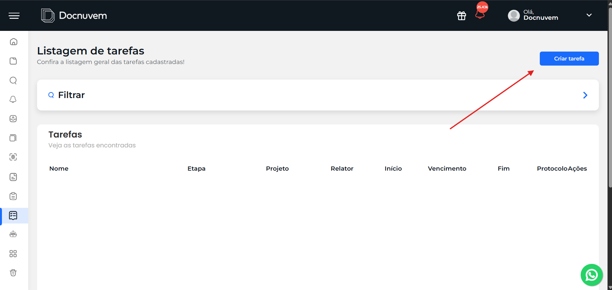

2. Informe o nome da tarefa, a prioridade, o prazo, o valor, o projeto do qual fará parte e a etapa em que será iniciada.

    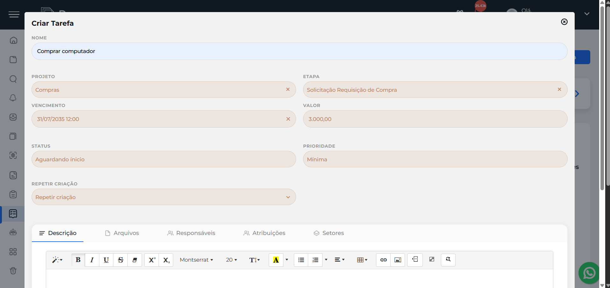

3. Na parte inferior da tela, preencha as informações adicionais: **Descrição** (texto livre), **Arquivo** (anexos acessíveis aos responsáveis), **Responsáveis** (usuários que executarão a tarefa), **Atribuições** (contatos vinculados, como fornecedor ou encarregado) e **Setores** (setores vinculados, como o setor responsável).

    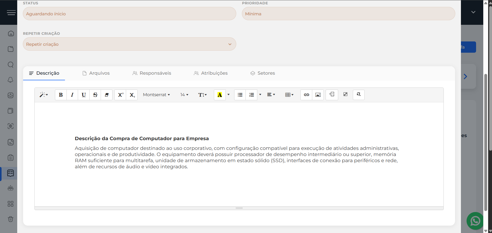

4. Revise as informações e clique em **Salvar**.

    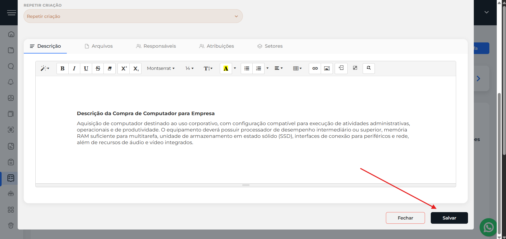

### Como editar uma tarefa

1. Na listagem de tarefas, clique na ação de editar da tarefa desejada.

    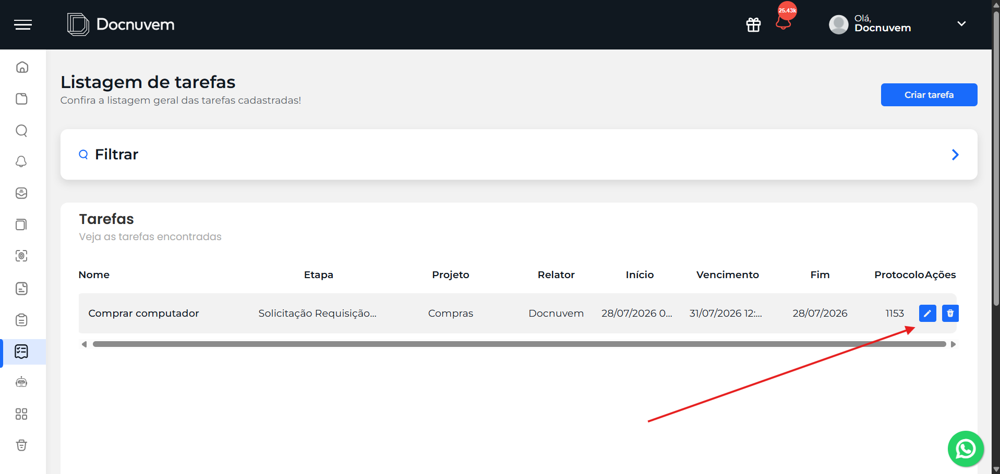

2. Ajuste as informações necessárias.

    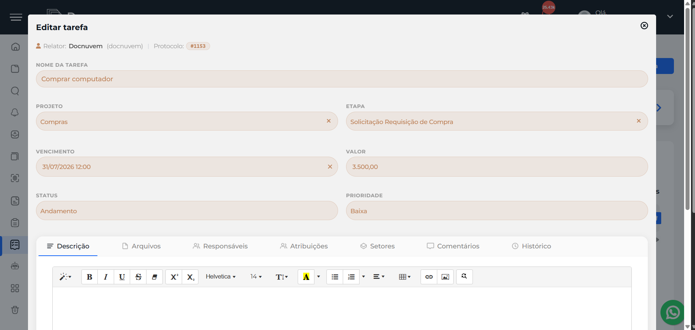

3. Clique em **Salvar** para aplicar as alterações.

    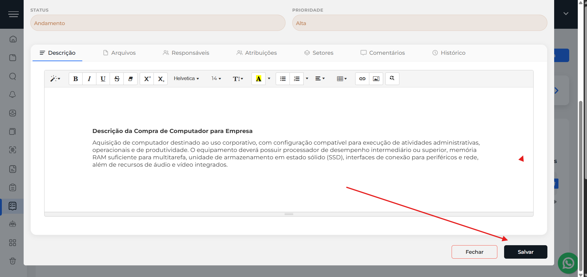

### Como excluir uma tarefa

Na listagem de tarefas, clique na ação de excluir da tarefa desejada.

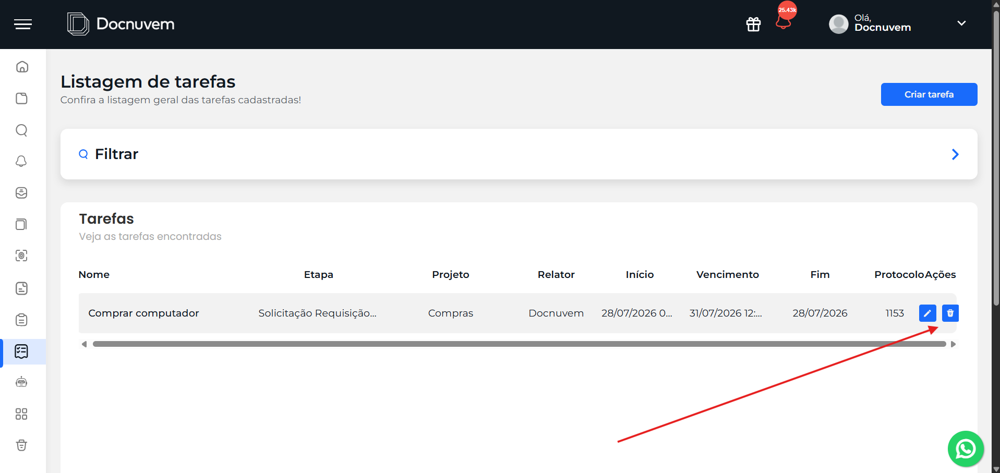

## Quadro Kanban

Permite visualizar as tarefas de um projeto em formato de quadro, organizadas de acordo com as etapas cadastradas. É por essa tela que o usuário acompanha o andamento das tarefas e movimenta os cards entre as etapas do fluxo.

Ao acessar a tela, o quadro aparece inicialmente em branco: é necessário abrir o filtro e selecionar o projeto a exibir. Depois da seleção, o Docnuvem carrega o quadro correspondente, com suas etapas e tarefas.

Usuários administradores visualizam todas as tarefas do quadro selecionado; usuários não administradores visualizam apenas as tarefas em que são relatores ou responsáveis. A tela também conta com o botão **Vencidas**, que direciona para uma visão com o resumo das tarefas vencidas, seguindo a mesma regra de permissão.

### Como criar uma tarefa pelo Quadro Kanban

1. Acesse o Quadro Kanban e selecione o projeto a visualizar.
2. Localize a etapa em que a tarefa deve ser criada e clique no botão **+**.

    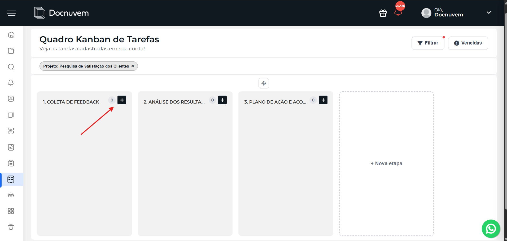

3. Preencha os dados da tarefa da mesma forma que na criação pela tela de Tarefas (veja [Como criar uma tarefa](#como-criar-uma-tarefa)).

    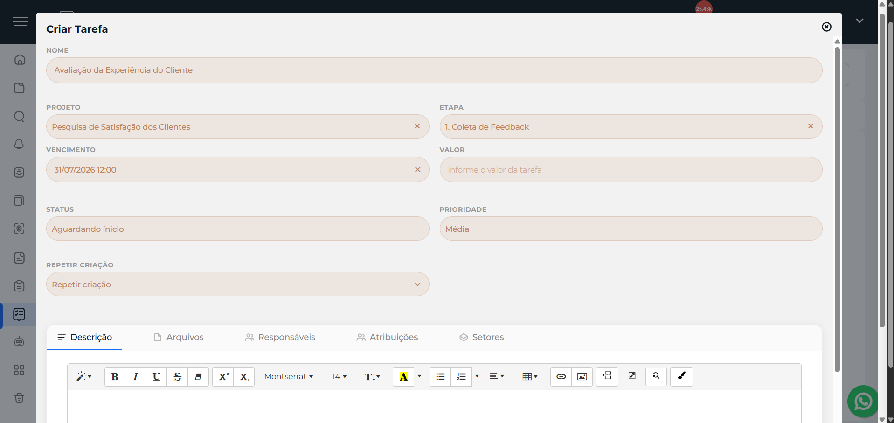

4. Revise as informações e clique em **Salvar**.

    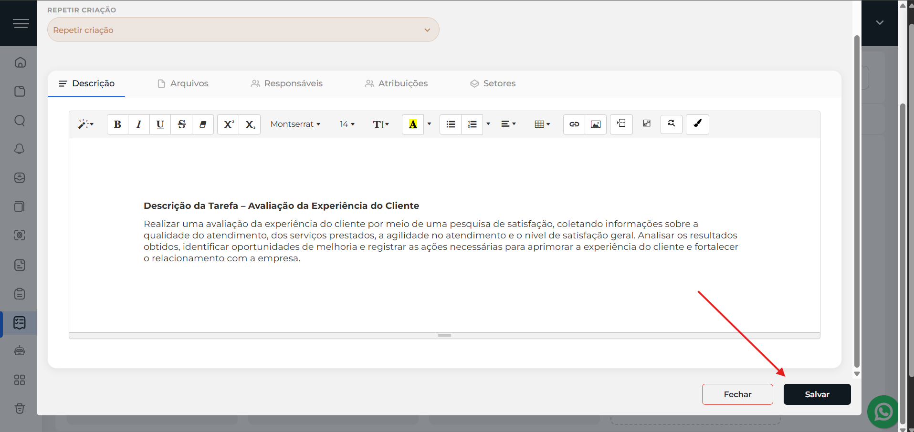

### Como alterar uma tarefa pelo Quadro Kanban

1. Clique no card correspondente dentro do quadro para abrir a tarefa.

    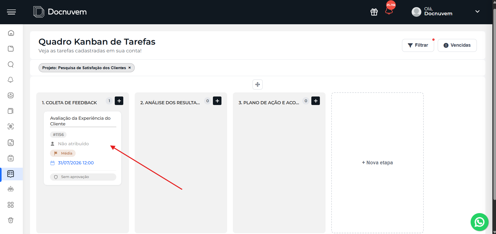

2. Visualize e altere as principais informações: nome, prioridade, prazo, valor, descrição, arquivos, responsáveis, atribuições e setores vinculados.

    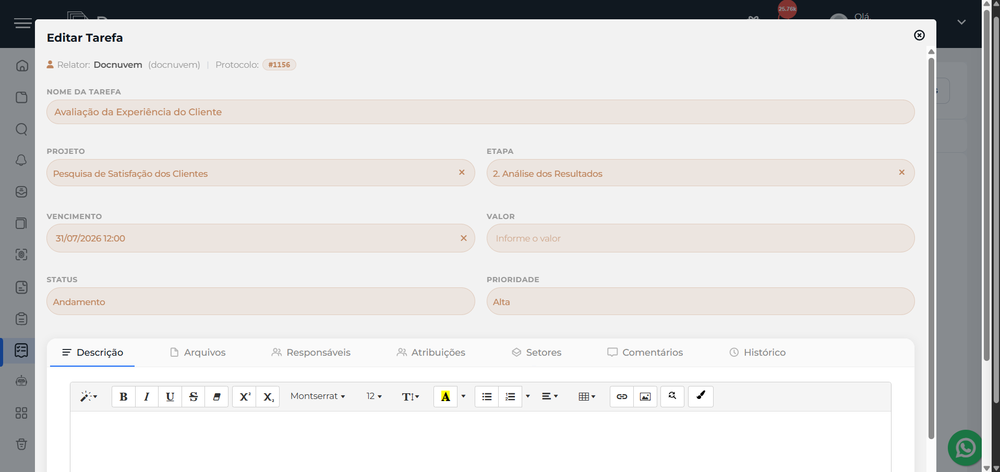

3. Use o chat da tarefa para trocar mensagens entre responsáveis, relator e aprovadores — os usuários envolvidos são notificados sobre as interações.

    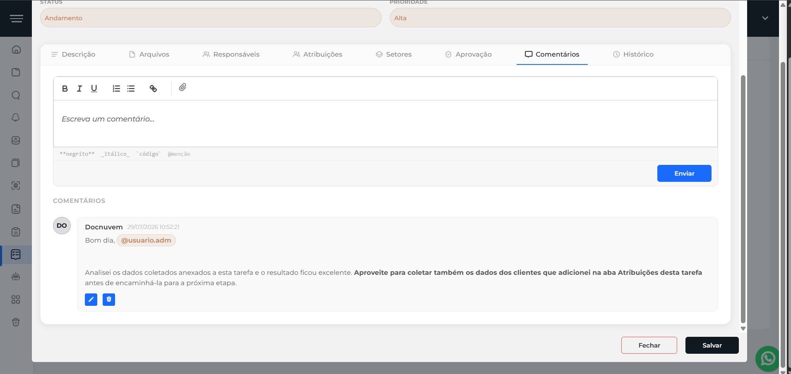

4. Consulte o histórico da tarefa para acompanhar as alterações e movimentações realizadas.

    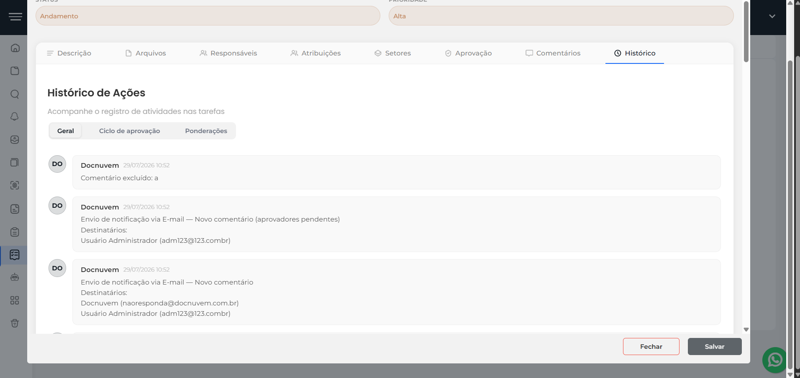

5. Para atualizar o andamento, arraste os cards entre as etapas do quadro.

    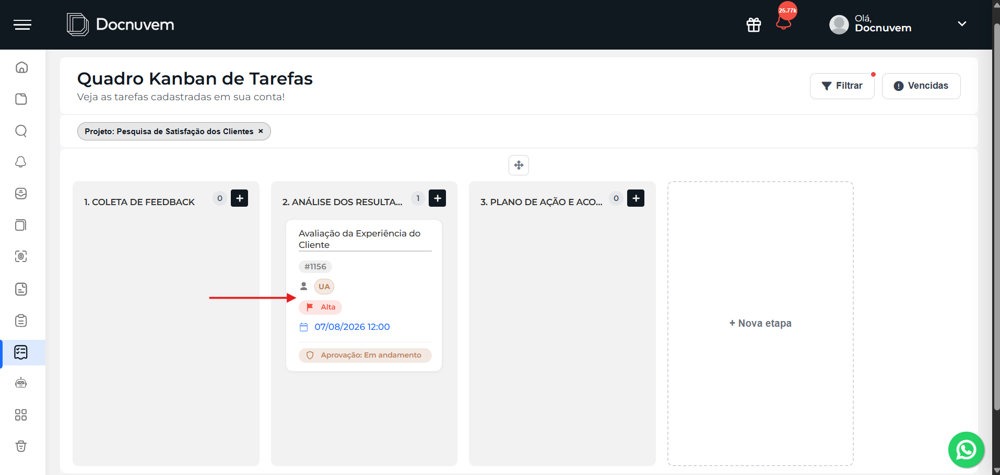

!!! info "Importante"
    Se a etapa de destino tiver aprovação ativada, a tarefa só avança depois que os responsáveis pela aprovação validarem a movimentação. Os usuários envolvidos são notificados durante esse processo.

## Calendário de Tarefas

Permite visualizar as tarefas em formato de calendário, facilitando o acompanhamento de prazos e vencimentos. Usuários administradores visualizam todas as tarefas; usuários não administradores visualizam apenas as tarefas em que são relatores ou responsáveis.

No calendário, o usuário relator pode arrastar o card de uma tarefa para alterar sua data de vencimento. Também é possível filtrar por um quadro específico, seguindo o mesmo funcionamento do filtro do Quadro Kanban.

### Como criar uma tarefa pelo Calendário de Tarefas

1. Clique em **Criar tarefa** ou selecione diretamente o dia do calendário em que a tarefa deve ser criada.

    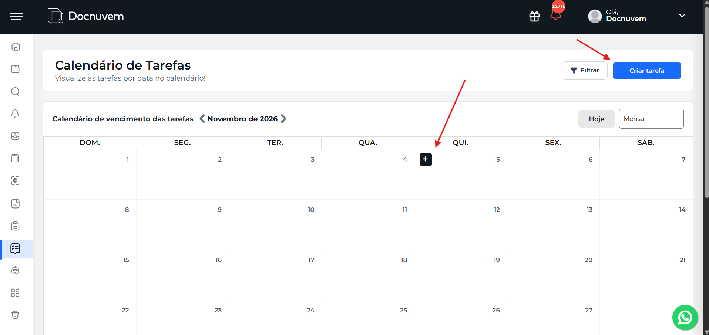

2. Preencha os dados da tarefa da mesma forma que na criação pela tela de Tarefas.

    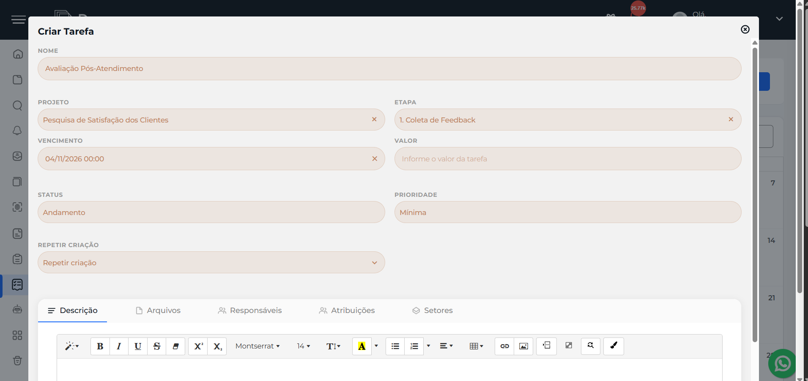

3. Revise as informações e clique em **Salvar**.

    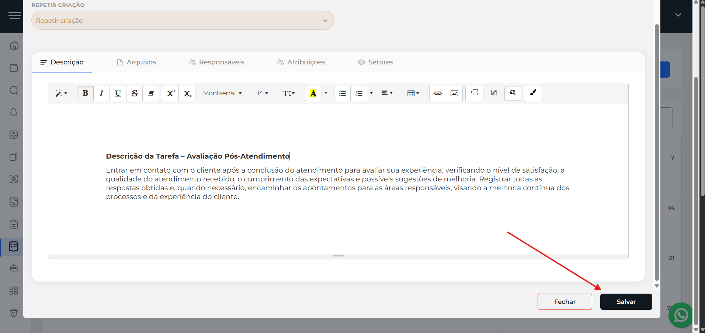

### Como editar uma tarefa pelo Calendário de Tarefas

1. Clique no card correspondente dentro do calendário para abrir a tarefa.

    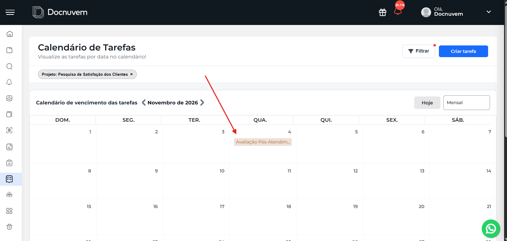

2. Visualize e altere as principais informações: nome, prioridade, prazo, valor, descrição, arquivos, responsáveis, atribuições e setores vinculados.

    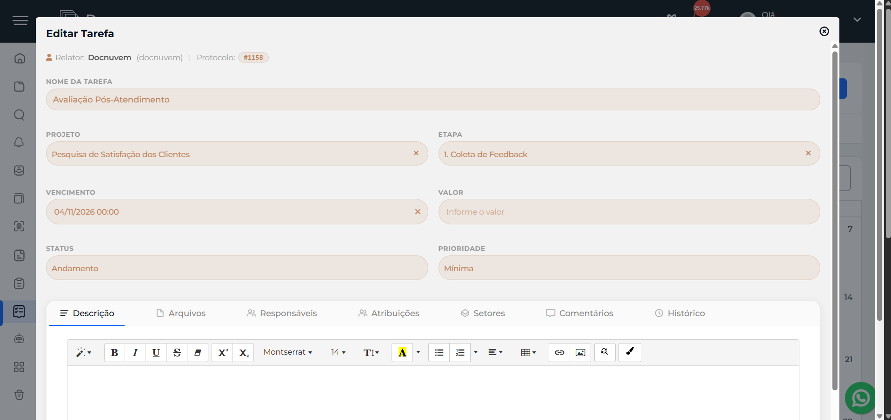

3. Use o chat da tarefa para trocar mensagens — os usuários envolvidos são notificados sobre as interações.

    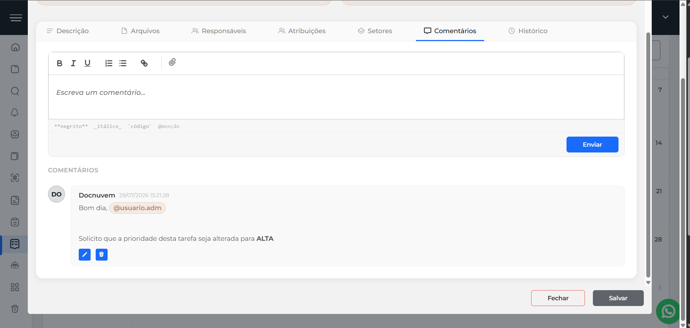

4. Consulte o histórico da tarefa para acompanhar as alterações e movimentações realizadas.

    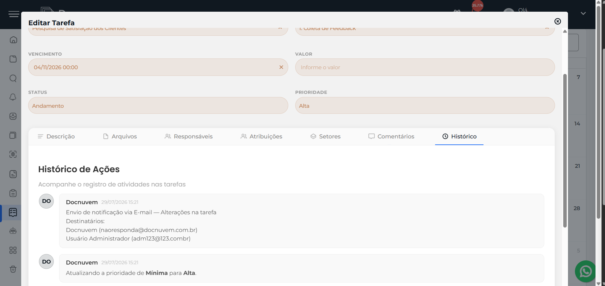

5. Para alterar o vencimento, o usuário relator pode arrastar o card da tarefa para outro dia do calendário.

    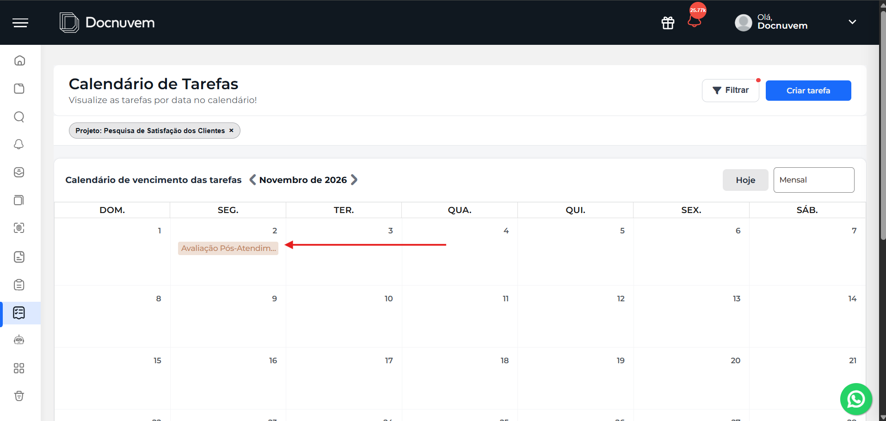

## Agendamentos

Usados para configurar tarefas que precisam ser criadas de forma recorrente. Esse recurso automatiza a criação das tarefas conforme o período definido pelo usuário, ajudando a evitar esquecimentos, atrasos e retrabalho em atividades que se repetem na rotina da empresa.

Na tela de Agendamentos é possível visualizar todos os agendamentos já criados, acompanhar suas principais informações, editar configurações existentes e criar novos agendamentos.

### Como criar um agendamento

1. Na tela de Agendamentos, clique em **Cadastrar novo agendamento**.

    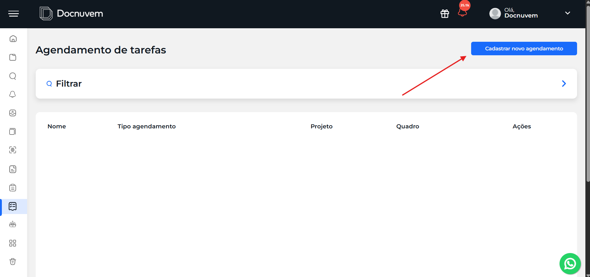

2. Informe o nome do agendamento, a prioridade da tarefa, o prazo de criação, o valor, o projeto do qual a tarefa fará parte e a etapa em que será iniciada.

    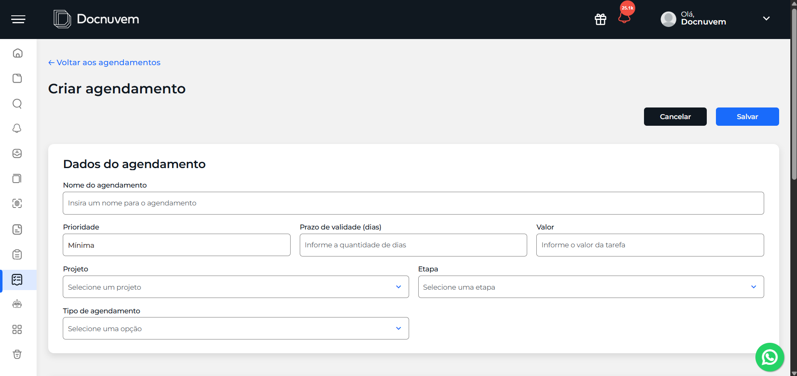

3. Preencha as informações adicionais da tarefa: **Descrição**, **Arquivo**, **Responsáveis**, **Atribuições** e **Setores** (mesmos campos da criação manual de tarefa).

    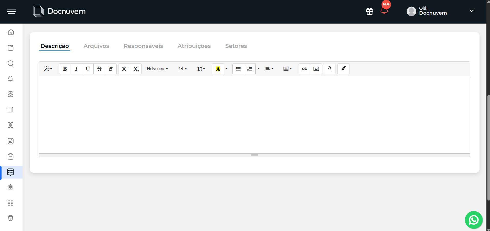

4. Escolha o tipo de agendamento conforme a recorrência desejada:
    - **Diário:** informe a hora em **Configurar hora**.
    - **Semanal:** informe a hora em **Configurar hora** e selecione os dias em **Dias da semana**.
    - **Quinzenal:** informe a hora em **Configurar hora** — as tarefas são geradas quinzenalmente a partir da data de criação do agendamento.
    - **Mensal:** informe a hora em **Configurar hora** e selecione uma opção em **Tipo de execução mensal**: **Dia fixo do mês** (informe o dia em **Escolha um dia do mês**), **Primeira/Última Ocorrência do Mês** (informe o dia da semana e se é a primeira ou a última ocorrência no mês) ou **Último dia do mês** (a tarefa é gerada no último dia do mês vigente).
    - **Anual:** informe a hora em **Configurar hora**, selecione o **Mês** e informe o dia em **Escolha um dia do mês**.

**Resultado esperado:** o agendamento fica ativo e passa a criar tarefas automaticamente conforme a recorrência configurada.

### Como editar um agendamento

1. Na listagem de agendamentos, clique na ação de editar do agendamento desejado.

    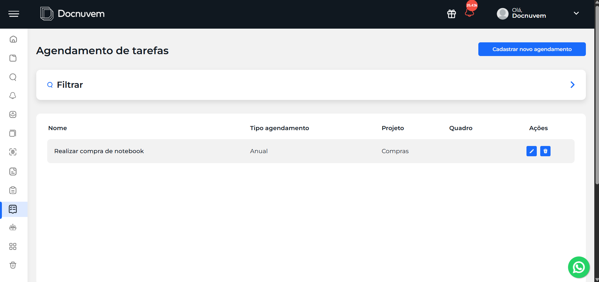

2. Ajuste as informações necessárias.

    

3. Clique em **Salvar** para aplicar as alterações.

    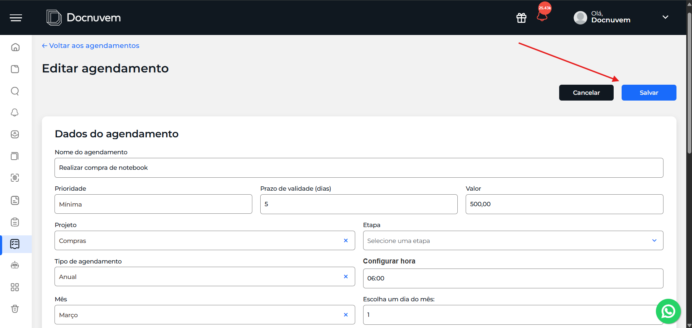

### Como excluir um agendamento

Na listagem de agendamentos, clique na ação de excluir do agendamento desejado.

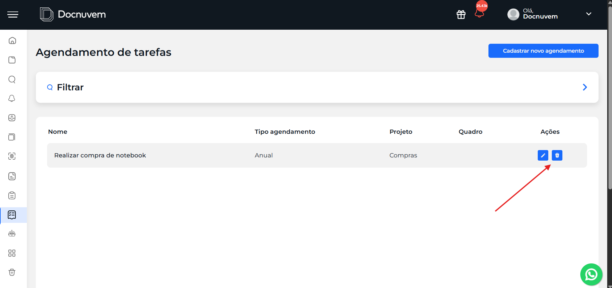

## Fluxo de aprovação

Permite acompanhar as tarefas que dependem de aprovação para avançar no quadro Kanban, garantindo que a movimentação entre etapas seja validada pelos usuários definidos como aprovadores.

A listagem exibe: **Nome**, **Etapa**, **Projeto**, **Status do fluxo**, **Participação**, **Início**, **Fim** e **Protocolo**.

Ao clicar na ação disponível em uma tarefa, o Docnuvem abre a tela de visualização do fluxo, onde é possível consultar as informações da tarefa, acompanhar seu andamento, usar o chat para troca de mensagens entre responsáveis e aprovadores, aprovar o avanço da tarefa ou reprovar a solicitação com considerações. As mensagens enviadas pelo chat geram notificações para os usuários envolvidos no fluxo.

### Como aprovar ou reprovar uma tarefa

1. Na listagem do Fluxo de aprovação, clique na ação disponível para abrir a tarefa.

    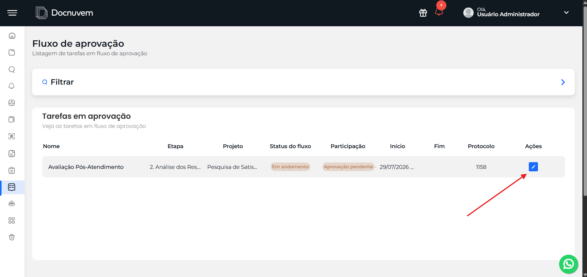

2. Confira as informações da tarefa e acompanhe seu andamento antes de tomar uma decisão.

    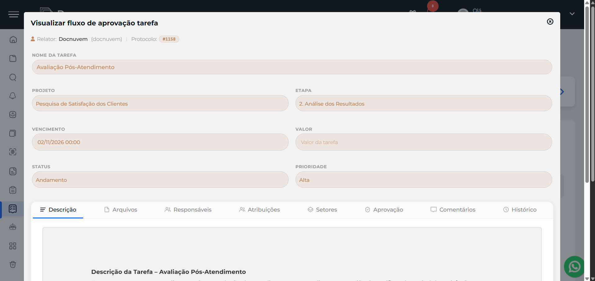

3. Se necessário, use o chat para trocar mensagens com responsáveis e aprovadores — os envolvidos são notificados.

    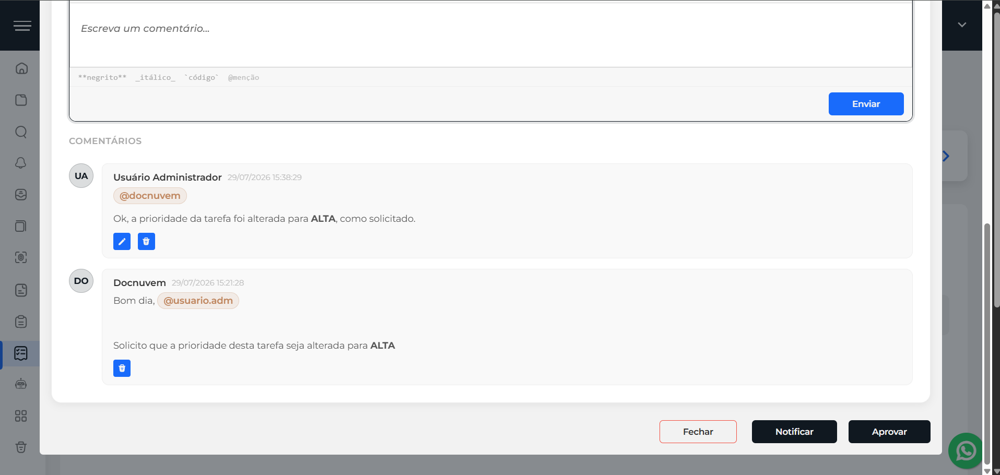

4. Para aprovar a movimentação, clique na opção de aprovação disponível na tela — a tarefa avança automaticamente para a próxima etapa do quadro.

    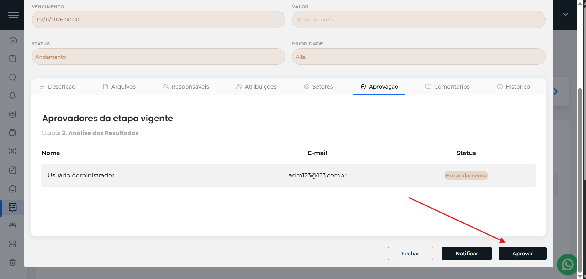

5. Para reprovar a movimentação, clique na opção de reprovação e informe as considerações sobre o motivo da reprovação.

    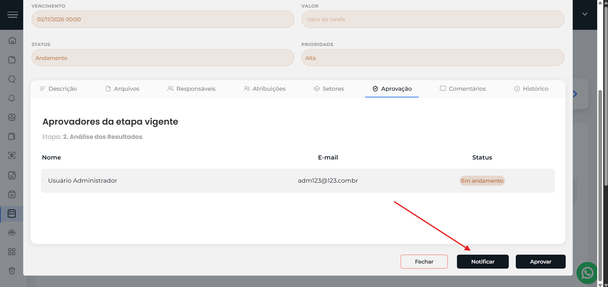

## Veja também

- [Meus Cadastros](07-meus-cadastros.md) — cadastro de usuários, setores e contatos usados como responsáveis, setores e atribuições de tarefas.
